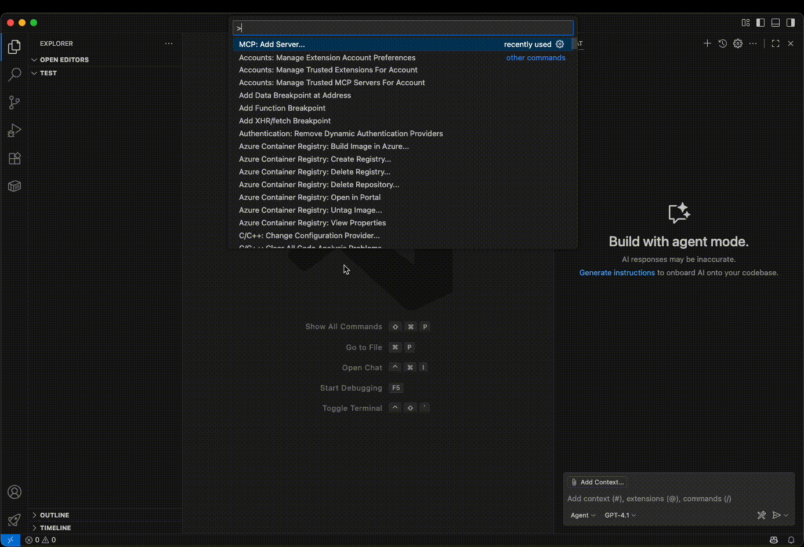

LODA integrates with various platforms and technologies to provide comprehensive access to integer sequence programs and computational resources. This page covers all available connectors, integrations, and ways to interact with the LODA ecosystem.

## Table of Contents

- [OEIS Integration](#oeis-integration)
- [BOINC Distributed Computing](#boinc-distributed-computing)
- [Formula Generation](#formula-generation)
- [PARI/GP Computer Algebra](#parigp-computer-algebra)
- [Model Context Protocol (MCP)](#model-context-protocol-mcp)
- [REST API](#rest-api)
- [Libraries](#libraries)
- [Discord Community](#discord-community)

## OEIS Integration

LODA has deep integration with the [On-Line Encyclopedia of Integer Sequences® (OEIS®)](https://oeis.org/), the world's largest database of integer sequences. The primary goal of LODA is to generate a corresponding program for every sequence in the OEIS that computes its terms algorithmically.

Both sequences and their programs are referenced using OEIS identifiers (A-numbers). For example, A000045 refers to the Fibonacci sequence, and LODA aims to provide efficient programs that compute this sequence's terms. The LODA language includes a native `seq` operation that allows programs to call other OEIS sequence programs, enabling compositional program construction and reuse of existing computational patterns.

Visit the [LODA program database](https://loda-lang.org/programs) to explore thousands of existing programs for OEIS sequences.

## BOINC Distributed Computing

Program mining is the automated process of discovering new LODA programs for OEIS sequences using evolutionary algorithms and machine learning techniques. The goal is to find the shortest, most efficient programs that correctly compute each sequence's terms. This computational search process requires significant computing power, which is why LODA leverages distributed computing through [BOINC](https://boinc.berkeley.edu/) - Berkeley's open-source platform for volunteer computing that enables scientists to harness the collective power of computers worldwide.

Join the distributed computing effort to mine new integer sequence programs through the [LODA project on BOINC](https://boinc.loda-lang.org/loda/). By contributing your computer's idle processing power, you help discover new mathematical relationships and expand the database of known computational patterns for integer sequences.

### Getting Started with BOINC
1. **Install BOINC**: Download the [BOINC client](https://boinc.berkeley.edu/download.php) for your platform
2. **Join the project**: Add the LODA project URL: `https://boinc.loda-lang.org/loda/`
3. **Start computing**: Your computer will automatically download work units and contribute to program discovery

All discovered programs are credited to contributors and stored in the [loda-programs](https://github.com/loda-lang/loda-programs) repository.
You can track your contributions on the [LODA BOINC leaderboard](https://boinc.loda-lang.org/loda/top_users.php) and monitor the overall progress on the [mining dashboard](https://dashboard.loda-lang.org/grafana/)

## Formula Generation

LODA programs are iterative and assembly-like, making them well-suited for program synthesis and mining, efficient execution, and automatic optimization. However, they can be difficult for humans to understand and don't directly reveal mathematical insights. To bridge the gap between computational discovery and mathematical understanding, LODA supports generating formulas from program code.

This formula generation capability transforms iterative algorithms into mathematical expressions that can range from closed-form formulas to complex recurrence relations. This transformation serves multiple purposes: it makes programs more accessible to mathematicians, enables seamless integration with computer algebra systems like PARI/GP, and helps identify whether a program implements a previously unknown mathematical formula that may not yet be documented in the OEIS.

## PARI/GP Computer Algebra

[PARI/GP](https://pari.math.u-bordeaux.fr/) is a powerful computer algebra system designed for fast computations in number theory, algebraic geometry, and related fields. It provides extensive mathematical functions, symbolic computation capabilities, and tools for rigorous mathematical analysis - making it an ideal partner for LODA's computational discoveries.

The integration between LODA and PARI/GP creates a complete mathematical discovery pipeline: researchers can use LODA's program mining to discover unknown and efficient algorithms for OEIS sequences, generate human-readable formulas to understand the mathematical structure, and then export to PARI/GP for formal analysis and verification.

## Model Context Protocol (MCP)

The [Model Context Protocol (MCP)](https://modelcontextprotocol.io/) allows AI assistants to connect with external data sources and tools. MCP acts as a bridge between AI models and the applications they need to work with.

LODA provides an MCP server that gives AI assistants access to the full LODA database and API. Through this connection, you can ask an AI to search for integer sequences, examine LODA programs, run code to generate sequence terms, and explore the relationships between different sequences and programs. The AI can help you discover patterns in the data, find contributors and their work, and navigate the mathematical connections within the LODA collection.

### Server Endpoint
```
https://api.loda-lang.org/v2/mcp/
```

### Visual Studio Code with GitHub Copilot

1. Install the GitHub Copilot extension
2. Open the Command Palette (`Cmd+Shift+P` on macOS, `Ctrl+Shift+P` on Windows)
3. Select `MCP: Add server...`
4. Choose `HTTP (HTTP or Server-Sent Events)`
5. Enter the server URL: `https://api.loda-lang.org/v2/mcp/`
6. Assign a name to the server (e.g., "LODA")
7. Select either `workspace` or `global` scope
8. Confirm and trust the server



### Example AI Interactions

Once connected, you can ask your AI assistant to perform complex LODA operations:

```text
Show me the current LODA database statistics and find the top 5 contributors.
```

```text
Search for sequences related to prime numbers and show me the LODA program for the first result.
```

```text
Find the LODA program for A000045 (Fibonacci), then modify it to compute only even Fibonacci numbers and test the result.
```

```text
What are the most commonly used LODA programs (highest usage stats) and what sequences do they compute?
```

```text
Search for sequences with the keyword 'core' but exclude those marked as 'hard', then analyze the first program's dependencies.
```

The MCP integration enables AI assistants to perform sophisticated mathematical research workflows, combining sequence discovery, program analysis, and computational verification in natural language interactions.

## REST API

The LODA REST API provides programmatic access to sequence data, programs, and mining statistics. It enables you to search and retrieve information about integer sequences and their corresponding programs. You can run LODA programs directly through the API to generate sequence terms, submit new programs for evaluation, and explore the mathematical relationships between sequences. The API also provides insights into the community aspect - showing who contributed which programs, which sequences are most popular, and how programs build upon each other through dependencies.

### Base URL
```
https://api.loda-lang.org/v2/
```

The complete API documentation with interactive examples is available at:
[https://api.loda-lang.org/v2/openapi](https://api.loda-lang.org/v2/openapi)

## Libraries

LODA provides libraries and runtimes for multiple programming languages, making it easy to integrate LODA functionality into your applications and research projects.

### Available Languages

**C++**: The main LODA runtime and mining engine provides the core functionality for program execution, sequence computation, and program synthesis. This is the reference implementation used by the mining infrastructure, available at [loda-cpp](https://github.com/loda-lang/loda-cpp).

**Python**: A Python implementation that includes runtime capabilities and machine learning components for sequence analysis and program discovery. You can find it at [loda-python](https://github.com/loda-lang/loda-python).

**Rust**: Includes web-based editing capabilities and experimental features for the LODA language, along with research into abstraction and reasoning. The implementation is available at [loda-rust](https://github.com/loda-lang/loda-rust).

These libraries allow you to run LODA programs, generate sequences, and build applications that leverage the computational patterns discovered through program mining. Each implementation offers different strengths depending on your use case and preferred development environment.

## Discord Community

Connect with the LODA community on our Discord server for discussions, support, and collaboration. You can join our server via [loda-lang.org/discord](https://loda-lang.org/discord).

### Contributing Beyond Mining

To report bugs or request features, you can open issues in the respective [loda-lang GitHub repositories](https://github.com/loda-lang).
We also welcome pull requests for direct contributions.
